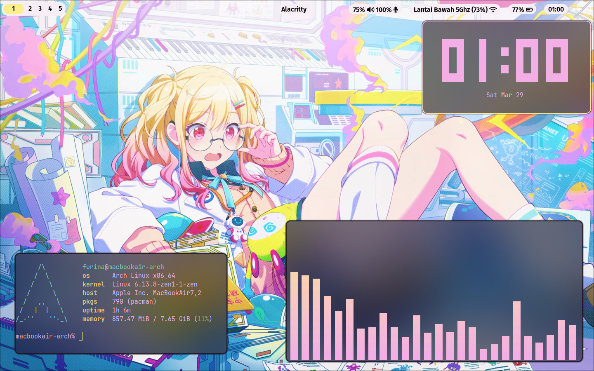
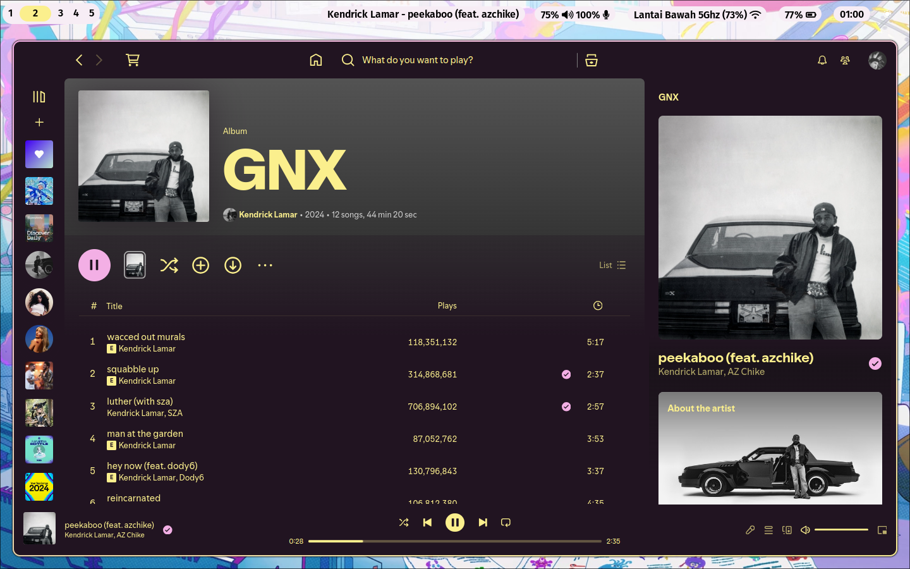
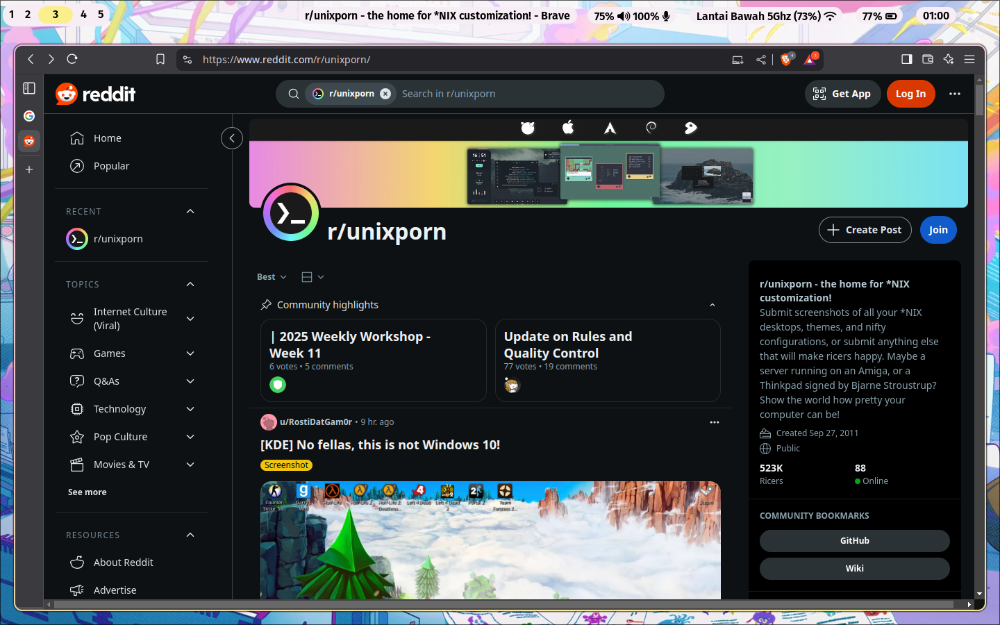
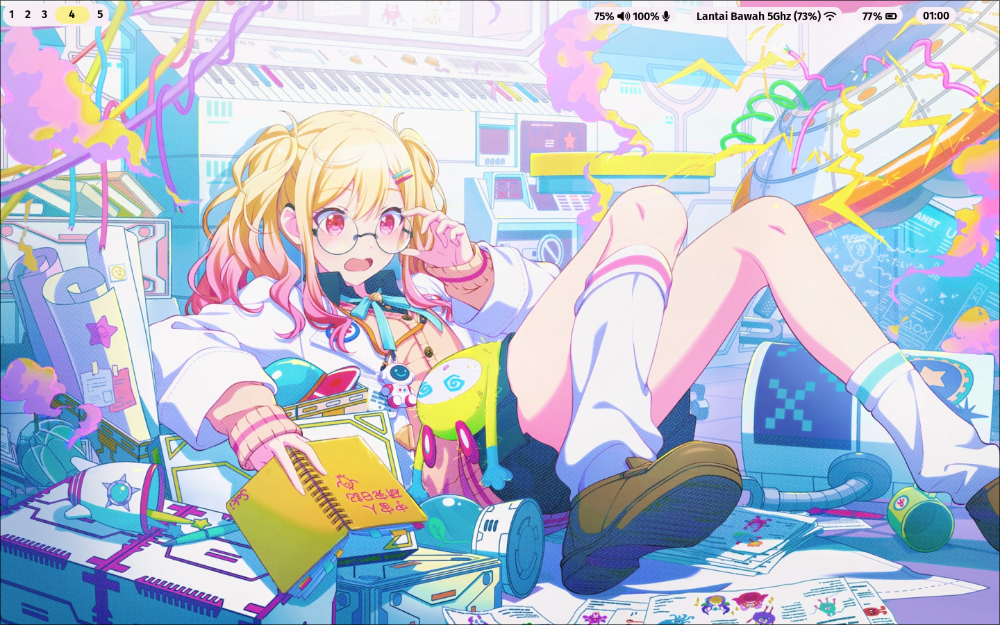
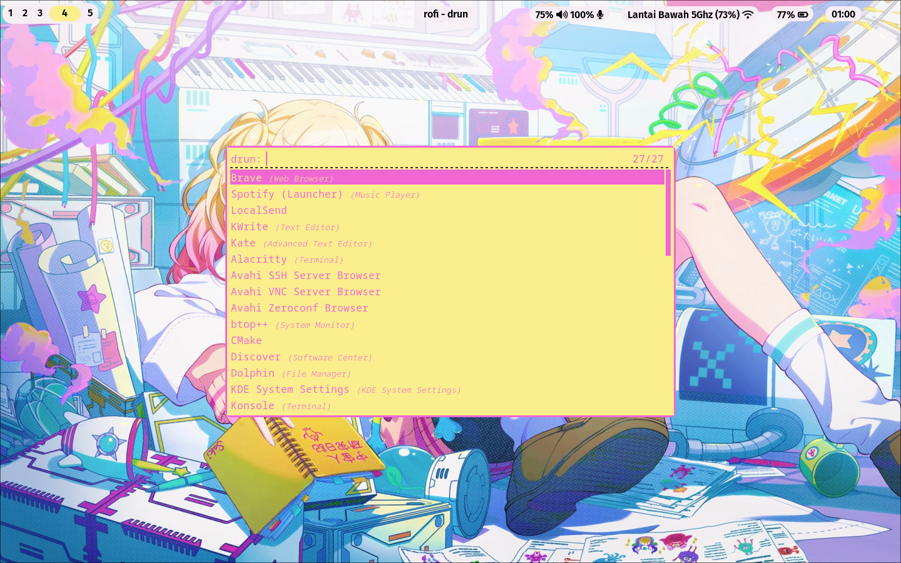

# Universal Trainee Saki - Hyprland Dotfiles

## Screenshot







## Install

If you're using Arch, adding Chaotic-AUR repo is recomended.
To set up your environment using these dotfiles, follow these steps:

1. **Install the required packages using** `pacman`:

```bash
sudo pacman -S hyprland hyprpaper waybar xdg-desktop-portal-hyprland wlogout pavucontrol ttf-fira-sans ttf-font-awesome ttf-jetbrains-mono-nerd alacritty cava fastfetch rofi
```

1.1. **Install Spotify**:

```bash
sudo pacman -S spotify-launcher
curl -fsSL https://raw.githubusercontent.com/spicetify/cli/main/install.sh | sh
```

2. **Clone the Repository**:

```bash
git clone https://github.com/furinalover8236/UTS-Hyprland.git
cd UTS-Hyprland
```

3. **Copy New Configurations**:
Remember you must in `UTS-Hyprland` folder to run following commands

```bash
cp -r .config ~/
cp -r .local ~/
cp -r .spicetify ~/
cp -r wallpaper ~/
cp -r .zshrc ~/
cp -r .bashrc ~/
```

4. **Apply Spicetify theme** (only for those who has Spotify installed):

```bash
spicetify config current_theme pinkyellow
spicetify apply
```

Congratulations! You have successfully completed the installation.

## Install Obsidian theme (only if you have Obsidian installed)

### Donwload theme
Open a terminal window and change the project directory to the themes directory.
```
cd path/to/vault/.obsidian/themes
git clone https://github.com/furinalover8236/obsidian-uts.git "Universal Trainee Saki"
```

### Enable theme
 * In Obsidian, open Settings.
 * In the side menu, select Appearance.
 * Next to Themes, select 'Universal Trainee Saki' from the dropdown list.

## Star History

<a href="https://www.star-history.com/#furinalover8236/UTS-Hyprland&Date">
 <picture>
   <source media="(prefers-color-scheme: dark)" srcset="https://api.star-history.com/svg?repos=furinalover8236/UTS-Hyprland&type=Date&theme=dark" />
   <source media="(prefers-color-scheme: light)" srcset="https://api.star-history.com/svg?repos=furinalover8236/UTS-Hyprland&type=Date" />
   
 </picture>
</a>
